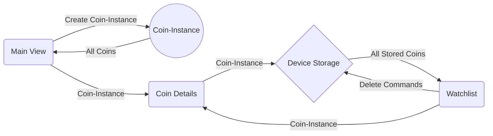

# CoinAnalyser
Coinanalyser is an IOS Application that allow users to discover new cryptocurrencies using markers that aren't readiliy availably. It allow users to sort coins by delevoper activity and shows a chart displaying lots of interesting data. Users have to option of saving lists of coins and sharing them. 

## Technical Design
### High level overview: 3 main views

- Main View: The overview of all available coins
	> In this view all coins are shown in a table alongside the change in developer activity of the last 12 weeks as opposed to the last 52 weeks.

- Watchlist View: The watchlist of saved coins
	> When a user saves a coin, it is saved to a separate list on the user's device. From this view the user can delete coins, view coin details and share the list of coins. 

- Detail View: The detailview of a coin
	> In this view charts are show for: Trading-volume, Developer Activity and Google Trends. Furthermore, user can Google their coin and open the corresponding CoinMarketCap page. Sharing a coin from this view is also possible. 

### Detail: Classes, Modules, File and Functions
All coininfo is stored in a seperate instance of a Coin-struct, which is used by all 3 views. 

[Mermaid](https://mermaidjs.github.io/)

**The Coin struct:** (defined in Coin.swift)
|Component  		|Type        |Description               |
|-------------------|------------|--------------------------|
|name				|`String`    |`Name of the Coin`|
|TwelveWeeksDev		|`Double`    |`Change in Dev.Act. last 12w/last 52 weeks`|
|commitArray        |`[Float]()` |`Github Commits p/week for Owner`|
|volumeArray        |`[Float]()` |`24h trade volume p/week`|
|trendArray         |`[Float]()` |`Google Searches p/week (max is always 100)`|
|loadCoins()        |`Function`  |`Load Coins from Device Storage`|
|loadSampleCoins() 	|`Function`  |`Load Sample if no Coins are stored`|
|saveCoins([Coin])  |`Function`  |`Save Coin to Device Storage`|
|DocumentsDirectory |`Path`      |`Set General Save Location`|
|ArchiveURL 		|`Path`      |`Set Save location p/Coin`|

**Main View:** (defined in AllCoinsViewController.swift)
|Component  		|Type        |Description               |
|-------------------|------------|--------------------------|
|Coin				|`Struct`    |`Instance of Coin`|
|coins				|`[Coin]()`  |`List of All Coins`|
|ref		        |`DatabaseReference` |`Link to Firebase Database`|
|TableView        	|`UITableView`|`Generated Table`|

**Watchlist:** (defined in MyCoinsViewController.swift)
|Component  		|Type        |Description               |
|-------------------|------------|--------------------------|
|Coin				|`Struct`    |`Instance of Coin`|
|coins				|`[Coin]()`  |`List of Stored Coins`|
|coinNames	        |`String` 	 |`Generated Text to Share `|
|TableView        	|`UITableView`|`Generated Table`|

**Coin Details:** (defined in CoinsDetailsViewController.swift)
|Component  		|Type        |Description               |
|-------------------|------------|--------------------------|
|Coin				|`Struct`    |`Instance of Coin`|
|graph				|`View`      |`Place to show all Charts`|
|url (google/cmc)	|`NSURL`     |`Clickable Link to do web-queries`|
|coinNames        	|`String` .  |`Generated Text to Share`|

## Challenges
One of the biggest challenges was getting the tables to display the correct coin-info. The data was gathered from Firebase after the table was loaded. This caused the table to be filled up with empty data. By incorporating completion handlers I was able to get the correct data in the table. 

Another big challenge was dealing with all secundaire activities pertaining to the assignment such as: Meeting daily with fellow student, taking daily pictures, creating a plan every week, chronicling activities and setting both short and long term goals. My main focus was creating a good app and I did not experience any added benefit by those activities. 

This was the first time using graphs. Getting the libraries working and being to able to stack multiple graphs in one view was quite challenging. 

## Defending Decisions
As it stands currently, the Main View only show the increase in development activity. Throughout the assignment, enough information was added to each coin to calculate a "Buy" or "Sell" advice per coin. Given more time, I would have liked to implement such an algorithm and adjust the main page to display this recommendation. Also, currently the app only lists Coins that have a know GitHub page, this was initially decided because the initial app would only show GitHub information. Now that more information has been added, more coins could be displayed, just not their GitHub information.
